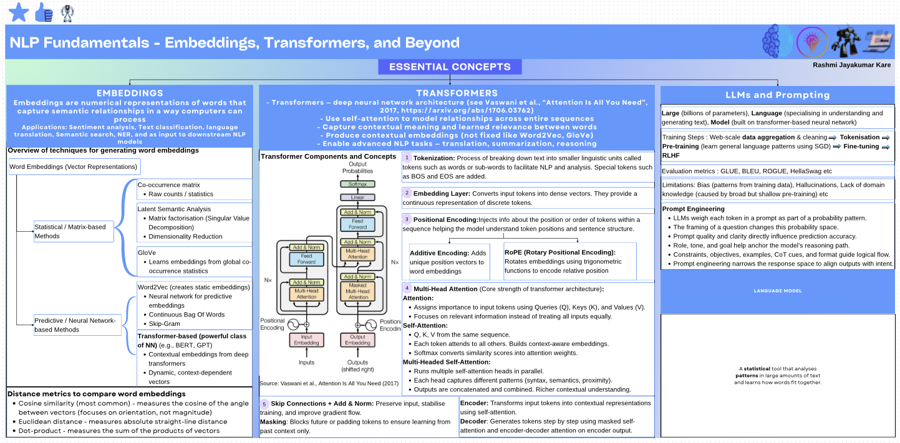
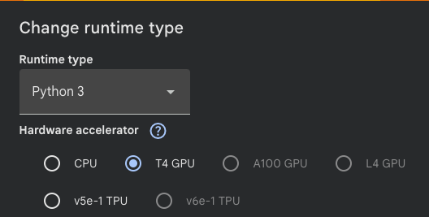

## Essential Concepts in Natural Language Processing and Generative AI

Placeholder for concepts learnt during the course.

## Problem Statement

Advancements in large language models (LLMs) are transforming the healthcare landscape by enabling intelligent solutions that efficiently process and interpret vast medical knowledge. This project explores the role of AI in healthcare through the development of a RAG based system designed to provide quick and reliable access to trusted medical information. By integrating established medical manuals into a centralized, AI-driven knowledge platform, the project aims to demonstrate how such technology can reduce information overload, enhance diagnostic efficiency, and support consistent, evidence-based clinical decision-making. The project seeks to highlight AI’s potential to improve patient care standards and overall healthcare outcomes through a practical, functional prototype.

### Data Description

- The dataset is derived from The Merck Manuals, medical references published by Merck & Co.
- It encompasses a comprehensive range of topics, including medical disorders, diagnostic procedures, laboratory tests, and pharmaceutical information.
- First published in 1899. The Merck Manuals have evolved into one of the most respected and widely used medical reference resources globally.
- The dataset is provided as a PDF file containing over 4,000 pages, systematically organized into 23 sections to facilitate structured knowledge retrieval and analysis.

## Environment Setup

- It is recommended to use Google Colab for this Notebook. Google Colab offers ready-to-use environment that avoids the time-consuming and error-prone setup involved in local installations.

- To boost performance, make sure to set the runtime to use the T4 GPU.
    To ensure you're using the T4 GPU runtime in Google Colab, follow these steps:

    * From the menu bar at the top of the page, select `Runtime`.
    * In the dropdown menu that appears, select `Change runtime type`.
    * In the "Runtime type" dropdown within the dialog box, select `T4 GPU`.
    * Click the `Save` button.
    * 

## About the Models Used in this Notebook

**llama-cpp-python** is a Python wrapper for llama.cpp, a universal LLM inference library that runs models efficiently using the GGUF file format.

**GGUF (GGML Universal File)** is a binary format storing model weights and metadata in a single file. It uses quantization to reduce precision, decreasing memory usage and increasing inference speed.

**Model Compatibility**: Supports any GGUF-converted model including Llama, Mistral, CodeLlama, Gemma, and Qwen.

**Key Components**:
- `Llama()` class: Main interface for loading and running models
- `hf_hub_download()`: A function from the Hugging Face Hub library to download specific files from Hugging Face repositories with automatic caching

**Models Used in This Notebook**

All models used are freely available from Hugging Face, requiring no API keys or credits.

| Model | Repository | File | Model card |
|-------|------------|------|---------|
| Llama-2-13B-chat | `TheBloke/Llama-2-13B-chat-GGUF` | `llama-2-13b-chat.Q5_K_M.gguf` | https://huggingface.co/TheBloke/Llama-2-13B-chat-GGUF |
| Mistral-7B-Instruct-v0.2 | `TheBloke/Mistral-7B-Instruct-v0.2-GGUF` | `mistral-7b-instruct-v0.2.Q6_K.gguf` | https://huggingface.co/TheBloke/Mistral-7B-Instruct-v0.2-GGUF |
| GTE-Large | `thenlper/gte-large` | SentenceTransformer | https://huggingface.co/thenlper/gte-large |